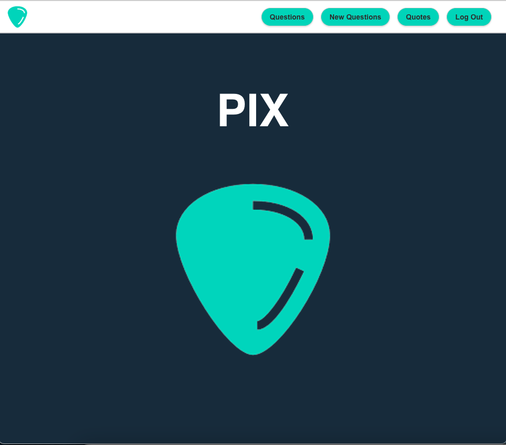

# Pix

Pix is a CRUD based application designed for music professionals and hobbyists alike.  It allows users to ask questions, receive feedback, and connect with others in the industry.  The app also serves as a hub for sharing knowledge and provides access to lyrics as quotes.  

When you open the app, you will be able to see the questions and quotes other users have posted. You'll be taken to the landing page with a sign up window. Once you sign up, you'll be able to ask questions and post lyric quotes.  Users can reply with a comment if they have a solution to the corresponding question.  Users have the option to edit or delete their questions, quotes, and comments if they choose.  

## [Click here to start the app!](https://pix-tritonic.netlify.app/)

## [Trello Board](https://trello.com/b/iR0dlKnx/pix-trello-board)

### [Meet the Team!]

### Technologies Used 💾

### Attributions 🤝
N/A

## Recent Changes 📈

- Style buttons, landing page, 

- Add and Delete Comments

## Ice Box 🧊

-[ ] Create a voting system with "likes" that are given to users based on how helpful the comment is for the corresponding question.

-[ ] Upvoting and downvoting on a user's comments and posts.

-[ ] Users and guests can view a user's profile and their individual details.

-[ ] Badges for accolades given to users for the number of helpful comments.

-[ ] Dark Mode!

-[ ] Mobile-responsive design.

-[ ] Add level of expertise to the user's profile.

-[ ] Add a pop-up window of the sign up/log in page when clicking the respective buttons while on the current page instead of being redirected to do so.
