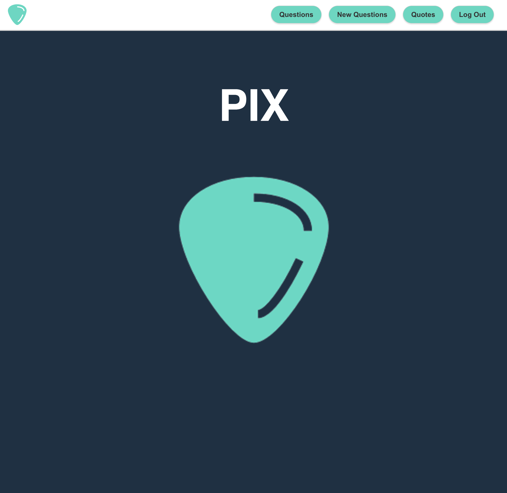

# PIX

Pix is a web application with CRUD functionality for music professionals and hobbyists alike.  It allows users to ask questions, receive feedback, and connect with others in the industry. The app also serves as a hub for knowledge sharing and provides access to lyrics as quotes. 

You will be directed to the landing page where you can sign up to make lyric quotes and ask questions.  You can edit or delete your question or comment at any time. You can also delete your quotes at any time.

## Getting Started

🖱️ [Click Here](https://pix-tritonic.netlify.app/) to access our application.

📒 [Trello](https://trello.com/b/iR0dlKnx/pix-trello-board) has been used as the planning material.

⬅️ [Backend](https://github.com/CaptMerica/pix-back-end.git) link.

## Developers
[Patrick Mazara](https://github.com/zaragotcode) - Full-Stack Developer & Scrum Master

[Ryan Merica](https://github.com/CaptMerica) - Full-Stack Developer & Git Commander

[Oscar Nunez](https://github.com/oscarnunez1) - Full-Stack Developer & UI Designer

## Technologies used 💾

 

## Latest Modifications 🧹
- Improved animation for buttons
- Restricted guest functionality in app
- Updated UI for comments section
- Implented logo in landing page
- Fixed password field in log in and sign up
- Added profile photos to questions and quotes

## Ice Box 🧊
- [ ] Dark Mode!
- [ ] "Most Helpful" Voting system for comments and posts.
- [ ] Award system for accolades.
- [ ] Enum for levels of expertise.
- [ ] Users and guests can view profiles.

## Special Thanks
[Mary Lueder](https://github.com/mjlueder)
[Robert Fridlender](https://github.com/robfrid06)
[Pin Chen](https://github.com/WarmSkin)